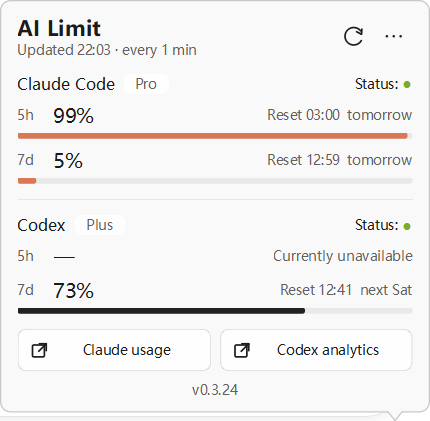
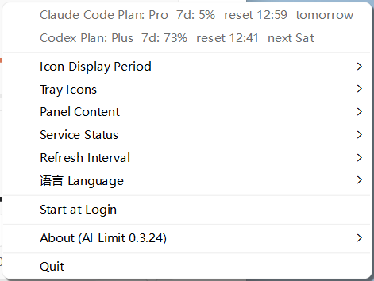
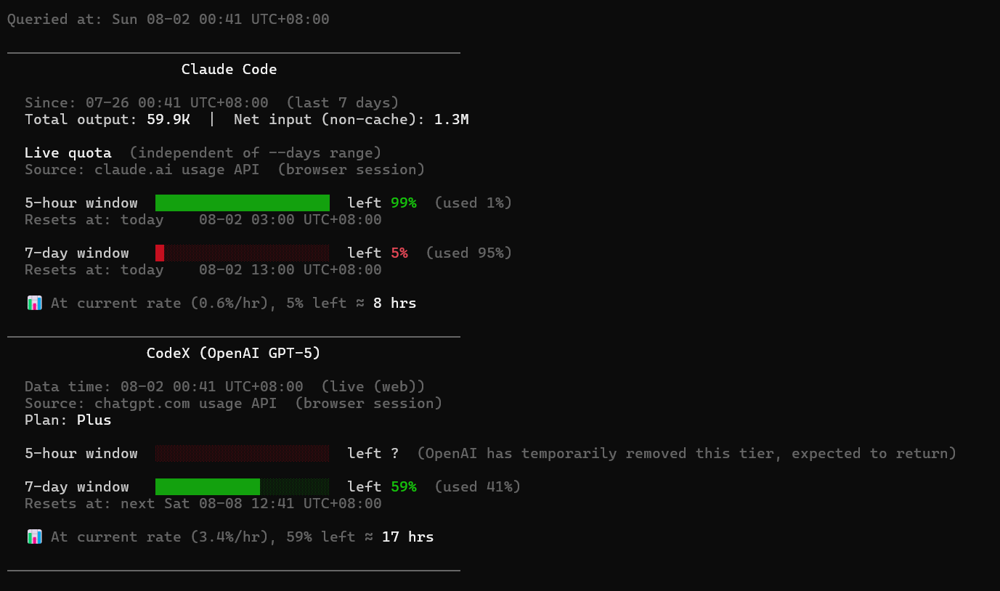

# ai-limit

English | [中文说明](README.zh-CN.md)

Official downloads: https://github.com/zhuchenxi113/ai-limit/releases

Website: https://ai-limit.waitsugar.com

A lightweight tool to monitor real-time **Claude Code** and **Codex** usage limits, quota consumption, and token statistics — so you can adjust your AI usage before hitting rate limits. Available as a Windows tray app, a macOS menu bar app, or a CLI.

If you find it useful, a Star would be appreciated: [GitHub](https://github.com/zhuchenxi113/ai-limit) · [Gitee](https://gitee.com/zhuchenxi113/ai-limit)

## macOS Menu Bar App

Lives in the menu bar, shows live quota at a glance — no terminal needed. Because it displays text data directly in the menu bar, it takes up more space than a typical icon-only app; a menu bar manager like Bartender is recommended.


<p align="center"></p>

**One-line install**

```bash
curl -fsSL https://raw.githubusercontent.com/zhuchenxi113/ai-limit/main/install.sh | bash
```

**First launch**

The app is signed with a Developer ID and notarized by Apple, so it should open normally — no Gatekeeper bypass needed. If macOS still blocks it (for example, if the notarization or certificate has lapsed), use whichever matches your macOS version:

- **macOS 15 Sequoia and later:** double-click the app. If the dialog only offers **Done** / **Move to Trash**, click **Done**, then open **System Settings → Privacy & Security**, scroll to **Security**, and click **Open Anyway** next to the blocked AI Limit message. Confirm with your password or Touch ID.
- **macOS 14 Sonoma and earlier:** right-click (Control-click) the app → **Open** → **Open** in the dialog.

**Features**

- Chinese / English UI toggle
- 5-hour / 7-day quota window toggle
- Claude and Codex shown simultaneously, each independently configurable
- Manual refresh
- Click to expand details (plan, usage, reset time)

**Build from source**

```bash
cd menubar
/opt/homebrew/bin/python3.13 setup.py py2app
bash make-dmg.sh
```

> Homebrew Python is required. Anaconda Python causes dylib path conflicts that prevent the packaged app from launching.

---

## Windows Tray App

The Windows app shows Claude Code and Codex quota as two compact taskbar tray icons. Click either icon to open the shared detail panel.

<table>
  <tr>
    <td align="center"></td>
    <td align="center"></td>
  </tr>
  <tr>
    <td align="center"><sub>Quota panel</sub></td>
    <td align="center"><sub>Tray menu and settings</sub></td>
  </tr>
</table>

Tray icons: 

**Install**

Download `ai-limit-<version>-setup.exe` from the latest [GitHub Release](https://github.com/zhuchenxi113/ai-limit/releases/latest) or [Gitee Release](https://gitee.com/zhuchenxi113/ai-limit/releases). The installer uses a visible, per-user setup wizard and does not require administrator access.

> The current Windows build does not have an Authenticode certificate. Windows may show **Unknown publisher** or a SmartScreen warning. This is expected for the unsigned release; do not continue if the filename or download source is unexpected.

**Requirements and first launch**

- Windows 11 (the currently verified target)
- Firefox signed in to [claude.ai](https://claude.ai) and/or [chatgpt.com](https://chatgpt.com)
- Chrome and Edge cookies are not supported on Windows because their App-Bound Encryption prevents third-party tools from reading them
- Windows may initially place both new tray icons in the hidden overflow area. Open the taskbar overflow and drag the Claude and Codex icons onto the taskbar if you want the quota values always visible

**Features**

- Chinese / English UI, with an always-discoverable bilingual language menu
- 5-hour and 7-day quota with reset times and service status
- Independently configurable Claude and Codex tray icons and panel sections
- Adjustable 1–5 minute refresh interval and manual refresh
- In-app update checks: AI Limit verifies the release installer with its embedded Ed25519 public key before opening the standard setup wizard

**Build from source**

Install Python dependencies, PyInstaller, and Inno Setup 6, then run from Windows PowerShell:

```powershell
pip install -r requirements.txt
pip install pyinstaller
cd menubar\windows
pyinstaller pyinstaller.spec --noconfirm --clean
& "$env:LOCALAPPDATA\Programs\Inno Setup 6\ISCC.exe" installer.iss
```

---

## CLI

The CLI supports macOS and Windows, and its output language is detected automatically from your system locale. Examples for both macOS Terminal and Windows PowerShell are shown below.

### Preview

#### macOS Terminal

<p align="center"></p>

#### Windows PowerShell

<p align="center"></p>

### Requirements

- macOS or Windows
- Python 3.8+
- Chrome or Firefox signed in to [claude.ai](https://claude.ai) (for Claude quota)
- Chrome or Firefox signed in to [chatgpt.com](https://chatgpt.com) (recommended path for Codex quota)
- Optional: [Codex CLI](https://developers.openai.com/codex/cli) installed and signed in (fallback when browser cookies are unavailable)

### Usage Prerequisites

ai-limit only reads your existing local Claude / ChatGPT browser session and local usage records. It does not provide subscriptions and does not bypass any quota limits.

- If Claude Code is available and signed in, Claude Code quota is shown.
- If ChatGPT / Codex is available and signed in, Codex quota is shown.
- Services that are unavailable or not signed in show a ⚠️ warning. You can hide each service from the menu bar app under `Services`.
- If both services are unavailable, the menu bar shows `ai-limit ⚠️` or the corresponding error state.

### Installation

**1. Clone the repo**

```bash
git clone https://github.com/zhuchenxi113/ai-limit.git ~/Developer/ai-limit
```

**2. Install dependencies**

```bash
pip install -r requirements.txt
```

**3. Add an alias**

Add to `~/.zshrc`:

```bash
alias ai-limit="python3 ~/Developer/ai-limit/usage.py"
```

Then reload:

```bash
source ~/.zshrc
```

### Usage

```bash
ai-limit              # Last 7 days (default)
ai-limit --days 1     # Today only
ai-limit --all        # Full history
ai-limit --detail     # Show per-model token breakdown
```

Output language is auto-detected from the system locale (Chinese on zh systems, English elsewhere). Override with `AI_LIMIT_LANG`:

```bash
AI_LIMIT_LANG=en ai-limit   # force English
AI_LIMIT_LANG=zh ai-limit   # force Chinese
```

---

## Data Sources

### Claude Code

| Data | Source |
|------|--------|
| Token usage details | `~/.claude/projects/**/*.jsonl` |
| macOS live quota | Browser cookie → `claude.ai/api/organizations/{orgId}/usage` |
| Windows live quota | Firefox cookie → `claude.ai/api/organizations/{orgId}/usage` |

On macOS, quota reading uses an active browser session and falls back gracefully with an error message and direct link if the cookie is unavailable. Windows exposes no data-source setting and does not fall back to OAuth. After signing in to claude.ai with Firefox it reads the web quota automatically; while signed out, the Claude icon shows a yellow warning and asks the user to sign in.

### Codex

On macOS, data sources are tried in this order:

| Priority | Data | Source | Triggers 5h window? |
|------|------|--------|------|
| 1 | Live quota | Browser cookie → `chatgpt.com/backend-api/codex/usage` | ❌ No |
| 2 | Live quota | `codex app-server` WebSocket → `account/rateLimits/read` | ⚠️ Yes |
| 3 | Local fallback | `~/.codex/sessions/**/*.jsonl` | ❌ No |

The browser path is read-only and returns **merged Cloud + CLI usage**. On macOS, if it fails and the current 5-hour window has expired, the `codex app-server` initialization fallback can start a new rolling window.

The Windows tray reads Firefox only and uses only the browser analytics endpoint. It exposes no data-source setting and does not fall back to CLI OAuth, local snapshots, or `codex app-server`.

## Notes

- Windows browser-cookie reading supports Firefox only; macOS can decrypt browser cookies through Keychain
- **Unofficial API**: Claude quota is fetched from an internal claude.ai endpoint, not an official API — it may break with future updates
- **Occasional ⚠️ (Cloudflare challenge)**: claude.ai / chatgpt.com may temporarily serve a Cloudflare bot-challenge to non-browser requests (based on TLS fingerprint — even a valid cookie can be blocked), surfaced as a ⚠️. It usually clears on its own. This affects any non-browser tool accessing these sites — the official Claude Code / Codex CLIs hit the same thing — so it is not a defect of ai-limit and generally needs no action. If the warning persists, open the Claude usage page or CodeX dashboard from the menu and **keep the tab open** — the active browser session accelerates recovery
- `<synthetic>` model entries are error placeholders written by Claude Code on API failures; they are excluded from all statistics
- Per-model output share is only available for Claude Code; Codex does not expose per-model breakdown

## Maintenance

This is a personal tool maintained on a best-effort basis. Issues and PRs are welcome but not guaranteed to be addressed promptly. No long-term support is promised.

- [Changelog](CHANGELOG.md)
- [Windows 0.3.24 release notes](docs/releases/v0.3.24.md)
- [Contributing guide](CONTRIBUTING.md)
- [Security policy](SECURITY.md)
- [Windows update security design](docs/windows-update-security.md)

## Other projects by the author

- [CalcPro — Calculator](https://apps.apple.com/us/app/calcpro-calculator-waitsugar/id6759244291): Available on the App Store. If the link doesn't open on your device, search for "WaitSugar CalcPro" in the App Store.
- [观点会审 (Decide)](https://decide.waitsugar.com/): A web-based decision-making tool.

## License

Project code: [Apache License 2.0](LICENSE)

Third-party notices: `browser-cookie3` is licensed under LGPL; the bundled Inno Setup Simplified Chinese translation is licensed under MIT (see `menubar/windows/languages/`).
