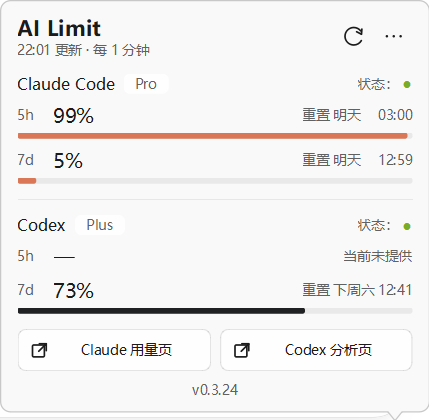
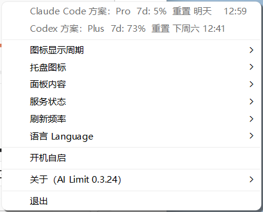
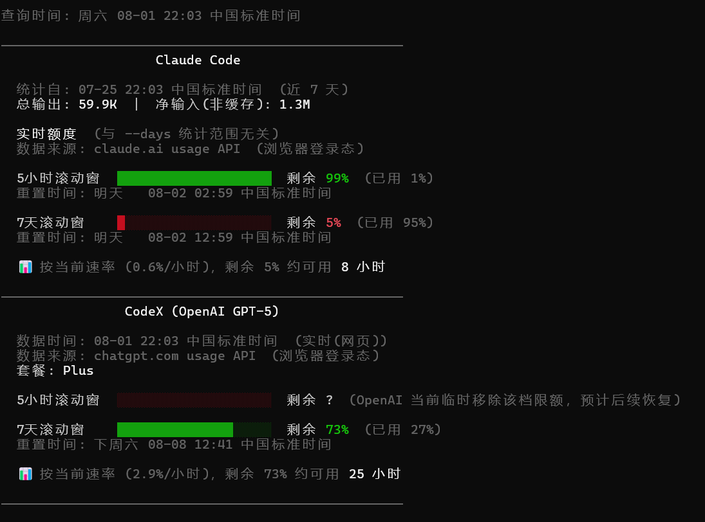

# ai-limit

[English](README.md) | 简体中文 | [繁體中文](README.zh-Hant.md)

GitHub 下载：https://github.com/zhuchenxi113/ai-limit/releases

官网：https://ai-limit.waitsugar.com

查看 Claude Code 和 CodeX 的实时剩余额度与 token 消耗情况。支持 Windows 托盘 App、macOS 菜单栏 App 和命令行。

如果觉得有用，欢迎给个 Star 鼓励作者：[GitHub](https://github.com/zhuchenxi113/ai-limit) · [Gitee](https://gitee.com/zhuchenxi113/ai-limit)

## macOS 菜单栏 App

常驻菜单栏，实时显示剩余额度，无需打开终端。由于直接在菜单栏显示文字数据，占用空间较大，建议配合 Bartender 等工具整理菜单栏。


<p align="center"></p>

**一键安装**

```bash
curl -fsSL https://raw.githubusercontent.com/zhuchenxi113/ai-limit/main/install.sh | bash
```

**首次启动**

App 已用 Developer ID 签名并通过 Apple 公证，正常情况下双击即可打开，无需绕过 Gatekeeper。如果 macOS 仍然拦截（例如公证或证书已经失效），按系统版本处理：

- **macOS 15 Sequoia 及以后：** 双击 App；若对话框只有「完成 / 移到废纸篓」，点「完成」，然后打开**系统设置 → 隐私与安全性**，下滚到「安全性」，在 AI Limit 的拦截提示处点**「仍要打开」**，再用密码或触控 ID 确认。
- **macOS 14 Sonoma 及更早：** 右键（Control 点按）App → **打开** → 对话框里再点**打开**。

<table><tr>
  <td></td>
  <td></td>
</tr></table>

**功能**

- 中英文切换
- 5小时 / 7天 窗口切换
- Claude 和 CodeX 额度同时显示，可单独切换
- 手动刷新
- 点击展开详细数据（套餐、用量、重置时间）

**从源码构建**

```bash
cd menubar
/opt/homebrew/bin/python3.13 setup.py py2app
bash make-dmg.sh
```

> 必须使用 Homebrew Python，不能用 Anaconda Python（dylib 路径冲突导致 App 无法运行）。

---

## Windows 托盘 App

Windows 版用两个紧凑的任务栏托盘图标分别显示 Claude Code 和 CodeX 额度；点击任意一个图标可打开共用详情面板。

<table>
  <tr>
    <td align="center"></td>
    <td align="center"></td>
  </tr>
  <tr>
    <td align="center"><sub>额度面板</sub></td>
    <td align="center"><sub>托盘菜单与设置</sub></td>
  </tr>
</table>

托盘图标：

Windows 切换深色/浅色模式后，图标会立即按新任务栏主题重绘；Explorer 重建通知区域后，图标也会自动恢复。Claude 数字根据橙色额度填充分成浅白/橙色两区，CodeX 数字根据黑白填充分成黑/白两区，保证小尺寸下仍有清晰反差。

**安装**

从最新的 [GitHub Release](https://github.com/zhuchenxi113/ai-limit/releases/latest) 或 [Gitee Release](https://gitee.com/zhuchenxi113/ai-limit/releases) 下载 `ai-limit-windows-<版本>-setup.exe`。安装程序使用当前用户范围的可见安装向导，不需要管理员权限。

> 当前 Windows 版本尚无 Authenticode 代码签名证书，Windows 可能显示“未知发布者”或 SmartScreen 警告。未签名版本出现该提示属于预期现象；如果文件名或下载来源不符合预期，请勿继续安装。

**环境要求与首次启动**

- Windows 11（目前实际验证的平台）
- Firefox 已登录 [claude.ai](https://claude.ai) 和/或 [chatgpt.com](https://chatgpt.com)
- Windows 上不支持读取 Chrome、Edge Cookie：它们的 App-Bound Encryption 会阻止第三方工具读取
- Windows 初次注册托盘图标时，可能把两个图标放入任务栏折叠区。若希望始终看到额度，请打开折叠区，把 Claude 和 CodeX 图标拖到任务栏

**功能**

- 中英文界面，以及始终可识别的中英双语语言菜单
- 5 小时、7 天额度、重置时间和服务状态
- Claude、CodeX 托盘图标及面板内容可分别配置
- 每 1–5 分钟自动刷新，并支持立即刷新
- App 内检查更新：AI Limit 会先用内置 Ed25519 公钥验证发布安装包，再打开标准安装向导

**从源码构建**

安装 Python 依赖、PyInstaller 和 Inno Setup 6，然后在 Windows PowerShell 中执行：

```powershell
pip install -r requirements.txt
pip install pyinstaller
cd menubar\windows
pyinstaller pyinstaller.spec --noconfirm --clean
& "$env:LOCALAPPDATA\Programs\Inno Setup 6\ISCC.exe" installer.iss
```

---

## 命令行

CLI 支持 macOS 和 Windows，输出语言根据系统语言自动切换，无需手动设置。下方分别展示 macOS 终端和 Windows PowerShell 的运行效果。

### 效果

#### macOS 终端

<p align="center"></p>

#### Windows PowerShell

<p align="center"></p>

### 环境要求

- macOS 或 Windows
- Python 3.8+
- Chrome 或 Firefox 已登录 [claude.ai](https://claude.ai)（用于读取 Claude 额度）
- Chrome 或 Firefox 已登录 [chatgpt.com](https://chatgpt.com)（用于读取 CodeX 额度，推荐路径）
- 可选：[CodeX CLI](https://developers.openai.com/codex/cli) 已安装并登录（作为浏览器 cookie 失效时的兜底路径）

### 使用前提

ai-limit 只读取你本机已有的 Claude / ChatGPT 登录态与本地使用记录，不提供订阅，也不会绕过任何额度限制。

- 已开通并登录 Claude Code：显示 Claude Code 额度。
- 已开通并登录 ChatGPT / CodeX：显示 CodeX 额度。
- 未开通或未登录的服务会显示 ⚠️ 提示，可在菜单栏 App 的「监控服务」里关闭对应显示。
- 如果两个服务都不可用，菜单栏会显示 `ai-limit ⚠️` 或对应错误提示。

### 安装

**Windows：一键安装（PowerShell）**

```powershell
irm https://raw.githubusercontent.com/zhuchenxi113/ai-limit/main/install.ps1 | iex
```

这会下载一个独立的 `ai-limit.exe`（不需要安装 Python），并加入你的用户 `PATH`。之后新开一个 PowerShell（或 Windows Terminal / WSL2）窗口，直接运行 `ai-limit` 即可。只写入当前用户范围的 `PATH`，不需要管理员权限。这跟上面的 Windows 托盘 App 安装程序是两回事，装一个不会自动装另一个。

**macOS / 任意平台手动安装：克隆源码运行**

**1. 克隆项目**

```bash
git clone https://gitee.com/zhuchenxi113/ai-limit.git ~/Developer/ai-limit
```

**2. 安装依赖**

```bash
pip install -r requirements.txt
```

**3. 配置 alias**

在 `~/.zshrc` 中添加：

```bash
alias ai-limit="python3 ~/Developer/ai-limit/usage.py"
```

然后执行：

```bash
source ~/.zshrc
```

### 用法

```bash
ai-limit              # 最近 7 天（默认）
ai-limit --days 1     # 今天
ai-limit --all        # 全部历史
ai-limit --detail     # 展示每个模型的详细 token 统计
```

输出语言自动识别系统 locale（中文系统输出中文，其他系统输出英文）。可用 `AI_LIMIT_LANG` 环境变量手动指定：

```bash
AI_LIMIT_LANG=en ai-limit   # 强制英文
AI_LIMIT_LANG=zh ai-limit   # 强制中文
```

---

## 数据来源

### Claude Code

| 数据 | 来源 |
|------|------|
| token 消耗明细 | `~/.claude/projects/**/*.jsonl` |
| macOS 实时剩余额度 | 浏览器 Cookie → `claude.ai/api/organizations/{orgId}/usage` |
| Windows 实时剩余额度 | Firefox Cookie → `claude.ai/api/organizations/{orgId}/usage` |

macOS 使用有效的浏览器登录态读取额度；Cookie 不可用时会显示失败原因和网页链接。Windows 不显示数据源设置，也不回退 OAuth：Firefox 登录 claude.ai 后自动读取网页额度；未登录时 Claude 图标显示黄色警告并提示登录。

### CodeX

macOS 按以下顺序尝试数据源：

| 优先级 | 数据 | 来源 | 是否触发 5h 窗口 |
|------|------|------|------|
| 1 | 实时剩余额度 | 浏览器 Cookie → `chatgpt.com/backend-api/codex/usage` | ❌ 不触发 |
| 2 | 实时剩余额度 | `codex app-server` WebSocket → `account/rateLimits/read` | ⚠️ 会触发 |
| 3 | 本地回退 | `~/.codex/sessions/**/*.jsonl` | ❌ 不触发 |

浏览器路径只读，并覆盖 **Cloud + CLI 合并用量**。macOS 上如果浏览器路径失败且原 5 小时窗口已经到期，`codex app-server` 初始化回退可能启动新的滚动窗口。

Windows 托盘固定读取 Firefox，只使用浏览器分析端点；不显示数据源设置，也不回退 CLI OAuth、本地快照或 `codex app-server`。

## 说明

- Windows 浏览器 Cookie 读取仅支持 Firefox；macOS 可使用系统 Keychain 解密浏览器 Cookie
- Claude 额度使用的是 claude.ai 内部接口，**非官方 API**，可能随版本变化失效
- **偶发的 ⚠️ 多为 Cloudflare 临时拦截**：claude.ai / chatgpt.com 会对非浏览器请求基于 TLS 指纹做人机校验（带有效 cookie 也可能被拦），表现为 ⚠️，**多数会自行恢复**。这是所有非浏览器访问官网工具的共性问题（官方 Claude Code / Codex CLI 自身也会遇到），非本工具缺陷，通常无需处理。若 ⚠️ 持续不消，从菜单打开「Claude 用量页」或「CodeX 分析页」，**保持该标签页不关闭**，效果更好
- `<synthetic>` 模型记录是 Claude Code 遇到 API 错误时写入的占位，不计入统计
- 各模型输出占比仅 Claude Code 提供；CodeX 不区分模型，无此数据

## 维护说明

个人工具，按自己的使用需求维护，不保证及时处理 issue 或 PR，也不承诺长期支持。

- [更新记录](CHANGELOG.md)
- [Windows 0.3.24 发布说明](docs/releases/v0.3.24.md)
- [贡献指南（英文）](CONTRIBUTING.md)
- [安全策略（英文）](SECURITY.md)
- [Windows 更新安全设计（英文）](docs/windows-update-security.md)

## 作者其他项目

- [CalcPro — 计算器](https://apps.apple.com/cn/app/id6759244291)：可在 App Store 下载；如果链接无法直接打开，请在 App Store 搜索 “WaitSugar CalcPro”。
- [观点会审](https://decide.waitsugar.com/)：网页版决策辅助工具。

## License

本项目代码使用 [Apache License 2.0](LICENSE)。

第三方说明：`browser-cookie3` 使用 LGPL 协议；随安装器打包的 Inno Setup 简体中文翻译使用 MIT 协议（见 `menubar/windows/languages/`）。
