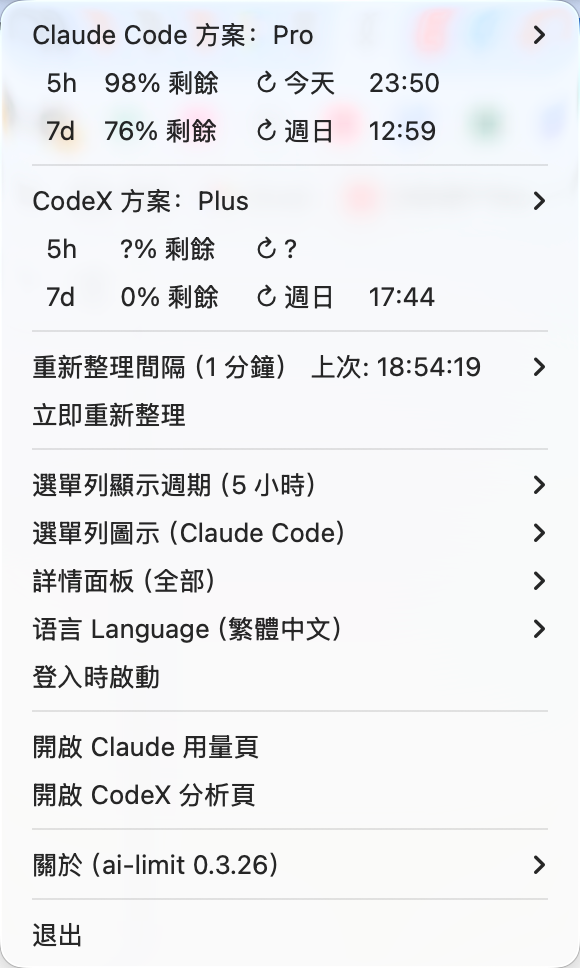
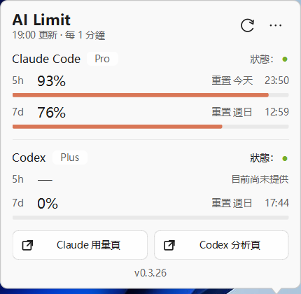
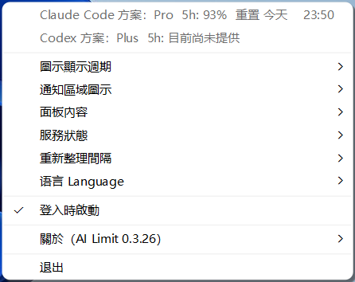

# ai-limit

[English](README.md) | [简体中文](README.zh-CN.md) | 繁體中文說明

官方下載地址：https://github.com/zhuchenxi113/ai-limit/releases

官網：https://ai-limit.waitsugar.com

查看 Claude Code 和 CodeX 的即時剩餘額度與 token 消耗情況。支援 Windows 工作列 App、macOS 選單列 App 和命令列。

如果覺得有用，歡迎給個 Star 鼓勵作者：[GitHub](https://github.com/zhuchenxi113/ai-limit) · [Gitee](https://gitee.com/zhuchenxi113/ai-limit)

## macOS 選單列 App

常駐選單列，即時顯示剩餘額度，無需開啟終端機。由於直接在選單列顯示文字資料，佔用空間較大，建議搭配 Bartender 等工具整理選單列。


<p align="center"></p>

**一鍵安裝**

```bash
curl -fsSL https://raw.githubusercontent.com/zhuchenxi113/ai-limit/main/install.sh | bash
```

**首次啟動**

App 已用 Developer ID 簽署並通過 Apple 公證，正常情況下按兩下即可開啟，無需繞過 Gatekeeper。如果 macOS 仍然攔截（例如公證或憑證已經失效），按系統版本處理：

- **macOS 15 Sequoia 及以後：** 按兩下 App；若對話方塊只有「完成 / 移到垃圾桶」，點「完成」，然後開啟**系統設定 → 隱私權與安全性**，下滑到「安全性」，在 AI Limit 的攔截提示處點**「仍要打開」**，再用密碼或 Touch ID 確認。
- **macOS 14 Sonoma 及更早：** 按住 Control 點按 App → **打開** → 對話方塊裡再點**打開**。

<table><tr>
  <td></td>
  <td></td>
</tr></table>

**功能**

- 簡體中文、繁體中文、English 切換
- 5 小時 / 7 天視窗切換
- Claude 和 CodeX 額度同時顯示，可個別切換
- 手動重新整理
- 點擊展開詳細資料（方案、用量、重置時間）

**從原始碼建置**

```bash
cd menubar
/opt/homebrew/bin/python3.13 setup.py py2app
bash make-dmg.sh
```

> 必須使用 Homebrew Python，不能用 Anaconda Python（dylib 路徑衝突導致 App 無法執行）。

---

## Windows 工作列 App

Windows 版用兩個緊湊的工作列圖示分別顯示 Claude Code 和 CodeX 額度；點擊任一個圖示可開啟共用詳情面板。

<table>
  <tr>
    <td align="center"></td>
    <td align="center"></td>
  </tr>
  <tr>
    <td align="center"><sub>額度面板</sub></td>
    <td align="center"><sub>工作列選單與設定</sub></td>
  </tr>
</table>

工作列圖示：

Windows 切換深色/淺色模式後，圖示會立即按新工作列主題重繪；檔案總管重建通知區域後，圖示也會自動恢復。Claude 數字根據橙色額度填滿分成淺白/橙色兩區，CodeX 數字根據黑白填滿分成黑/白兩區，確保小尺寸下仍有清晰對比。

**安裝**

從最新的 [GitHub Release](https://github.com/zhuchenxi113/ai-limit/releases/latest) 或 [Gitee Release](https://gitee.com/zhuchenxi113/ai-limit/releases) 下載 `ai-limit-windows-<版本>-setup.exe`。安裝程式使用目前使用者範圍的可見安裝精靈，不需要系統管理員權限。

> 目前 Windows 版本尚無 Authenticode 程式碼簽署憑證，Windows 可能顯示「未知發行者」或 SmartScreen 警告。未簽署版本出現該提示屬於預期現象；如果檔名或下載來源不符合預期，請勿繼續安裝。

**環境需求與首次啟動**

- Windows 11（目前實際驗證的平台）
- Firefox 已登入 [claude.ai](https://claude.ai) 和/或 [chatgpt.com](https://chatgpt.com)
- Windows 上不支援讀取 Chrome、Edge Cookie：它們的 App-Bound Encryption 會阻止第三方工具讀取
- Windows 初次註冊工作列圖示時，可能把兩個圖示放入工作列摺疊區。若希望始終看到額度，請開啟摺疊區，把 Claude 和 CodeX 圖示拖到工作列

**功能**

- 簡體中文、繁體中文、English 介面，以及始終可識別的三語語言選單
- 5 小時、7 天額度、重置時間和服務狀態
- Claude、CodeX 工作列圖示及面板內容可個別設定
- 每 1–5 分鐘自動重新整理，並支援立即重新整理
- App 內檢查更新：AI Limit 會先用內建 Ed25519 公鑰驗證發行的安裝套件，再開啟標準安裝精靈

**從原始碼建置**

安裝 Python 相依套件、PyInstaller 和 Inno Setup 6，然後在 Windows PowerShell 中執行：

```powershell
pip install -r requirements.txt
pip install pyinstaller
cd menubar\windows
pyinstaller pyinstaller.spec --noconfirm --clean
& "$env:LOCALAPPDATA\Programs\Inno Setup 6\ISCC.exe" installer.iss
```

---

## 命令列

CLI 支援 macOS 和 Windows，輸出語言根據系統語言自動切換，無需手動設定。下方分別展示 macOS 終端機和 Windows PowerShell 的執行效果。

### 效果

#### macOS 終端機

<p align="center"></p>

#### Windows PowerShell

<p align="center"></p>

### 環境需求

- macOS 或 Windows
- Python 3.8+
- Chrome 或 Firefox 已登入 [claude.ai](https://claude.ai)（用於讀取 Claude 額度）
- Chrome 或 Firefox 已登入 [chatgpt.com](https://chatgpt.com)（用於讀取 CodeX 額度，建議路徑）
- 可選：[CodeX CLI](https://developers.openai.com/codex/cli) 已安裝並登入（作為瀏覽器 cookie 失效時的備援路徑）

### 使用前提

ai-limit 只讀取你本機已有的 Claude / ChatGPT 登入狀態與本地使用記錄，不提供訂閱，也不會繞過任何額度限制。

- 已開通並登入 Claude Code：顯示 Claude Code 額度。
- 已開通並登入 ChatGPT / CodeX：顯示 CodeX 額度。
- 未開通或未登入的服務會顯示 ⚠️ 提示，可在選單列 App 的「監控服務」裡關閉對應顯示。
- 如果兩個服務都不可用，選單列會顯示 `ai-limit ⚠️` 或對應錯誤提示。

### 安裝

**1. 複製專案**

```bash
git clone https://gitee.com/zhuchenxi113/ai-limit.git ~/Developer/ai-limit
```

**2. 安裝相依套件**

```bash
pip install -r requirements.txt
```

**3. 設定 alias**

在 `~/.zshrc` 中新增：

```bash
alias ai-limit="python3 ~/Developer/ai-limit/usage.py"
```

然後執行：

```bash
source ~/.zshrc
```

### 用法

```bash
ai-limit              # 最近 7 天（預設）
ai-limit --days 1     # 今天
ai-limit --all        # 全部歷史
ai-limit --detail     # 展示每個模型的詳細 token 統計
```

輸出語言自動識別系統 locale（中文系統輸出中文，其他系統輸出英文）。可用 `AI_LIMIT_LANG` 環境變數手動指定：

```bash
AI_LIMIT_LANG=en ai-limit         # 強制英文
AI_LIMIT_LANG=zh-Hans ai-limit    # 強制簡體中文
AI_LIMIT_LANG=zh-Hant ai-limit    # 強制繁體中文
```

---

## 資料來源

### Claude Code

| 資料 | 來源 |
|------|------|
| token 消耗明細 | `~/.claude/projects/**/*.jsonl` |
| macOS 即時剩餘額度 | 瀏覽器 Cookie → `claude.ai/api/organizations/{orgId}/usage` |
| Windows 即時剩餘額度 | Firefox Cookie → `claude.ai/api/organizations/{orgId}/usage` |

macOS 使用有效的瀏覽器登入狀態讀取額度；Cookie 不可用時會顯示失敗原因和網頁連結。Windows 不顯示資料來源設定，也不回退 OAuth：Firefox 登入 claude.ai 後自動讀取網頁額度；未登入時 Claude 圖示顯示黃色警告並提示登入。

### CodeX

macOS 按以下順序嘗試資料來源：

| 優先順序 | 資料 | 來源 | 是否觸發 5h 視窗 |
|------|------|------|------|
| 1 | 即時剩餘額度 | 瀏覽器 Cookie → `chatgpt.com/backend-api/codex/usage` | ❌ 不觸發 |
| 2 | 即時剩餘額度 | `codex app-server` WebSocket → `account/rateLimits/read` | ⚠️ 會觸發 |
| 3 | 本地備援 | `~/.codex/sessions/**/*.jsonl` | ❌ 不觸發 |

瀏覽器路徑唯讀，並涵蓋 **Cloud + CLI 合併用量**。macOS 上如果瀏覽器路徑失敗且原 5 小時視窗已經到期，`codex app-server` 初始化備援可能啟動新的滾動視窗。

Windows 工作列固定讀取 Firefox，只使用瀏覽器分析端點；不顯示資料來源設定，也不回退 CLI OAuth、本地快照或 `codex app-server`。

## 說明

- Windows 瀏覽器 Cookie 讀取僅支援 Firefox；macOS 可使用系統 Keychain 解密瀏覽器 Cookie
- Claude 額度使用的是 claude.ai 內部介面，**非官方 API**，可能隨版本變化失效
- **偶發的 ⚠️ 多為 Cloudflare 暫時攔截**：claude.ai / chatgpt.com 會對非瀏覽器請求依據 TLS 指紋做人機驗證（帶有效 cookie 也可能被攔），表現為 ⚠️，**多數會自行恢復**。這是所有非瀏覽器存取官網工具的共通問題（官方 Claude Code / Codex CLI 本身也會遇到），非本工具缺陷，通常無需處理。若 ⚠️ 持續不消，從選單開啟「Claude 用量頁」或「CodeX 分析頁」，**保持該分頁不關閉**，效果更好
- `<synthetic>` 模型記錄是 Claude Code 遇到 API 錯誤時寫入的佔位，不計入統計
- 各模型輸出佔比僅 Claude Code 提供；CodeX 不區分模型，無此資料

## 維護說明

個人工具，按自己的使用需求維護，不保證及時處理 issue 或 PR，也不承諾長期支援。

- [更新記錄](CHANGELOG.md)
- [Windows 0.3.24 發行說明](docs/releases/v0.3.24.md)
- [貢獻指南（英文）](CONTRIBUTING.md)
- [安全政策（英文）](SECURITY.md)
- [Windows 更新安全設計（英文）](docs/windows-update-security.md)

## 作者其他專案

- [CalcPro — 計算機](https://apps.apple.com/us/app/calcpro-calculator-waitsugar/id6759244291)：可在 App Store 下載；如果連結無法直接開啟，請在 App Store 搜尋「WaitSugar CalcPro」。
- [觀點會審](https://decide.waitsugar.com/)：網頁版決策輔助工具。

## License

本專案程式碼使用 [Apache License 2.0](LICENSE)。

第三方說明：`browser-cookie3` 使用 LGPL 授權；隨安裝程式打包的 Inno Setup 簡體中文翻譯使用 MIT 授權（見 `menubar/windows/languages/`）。
